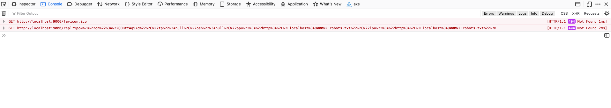
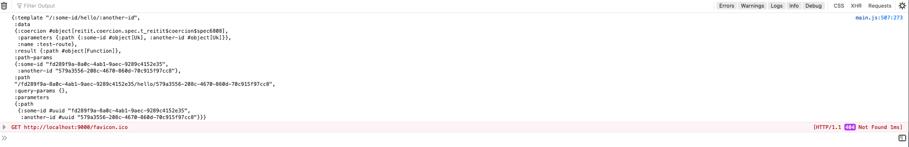

# Difference of behavior of code when compiling CLJS with :advanced and :simple as optimizations options

## How to run

1. First run

```bash
> clj -m cljs.main -d out-advanced --optimizations advanced -c hello-world.core
> clj -m cljs.main -d out-simple --optimizations simple -c hello-world.core
> clj -m cljs.main --serve
```

2. Open your browser (I tested in Chrome and Firefox) in http://localhost:9000/index-simple.html and http://localhost:9000/index-advanced.html

3. Open developer tools and check the logs

## Results

### `:optimizations simple`


### `:optimizations advanced`

